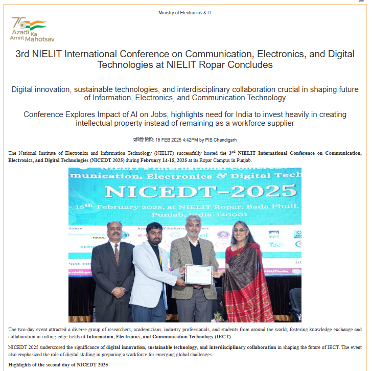
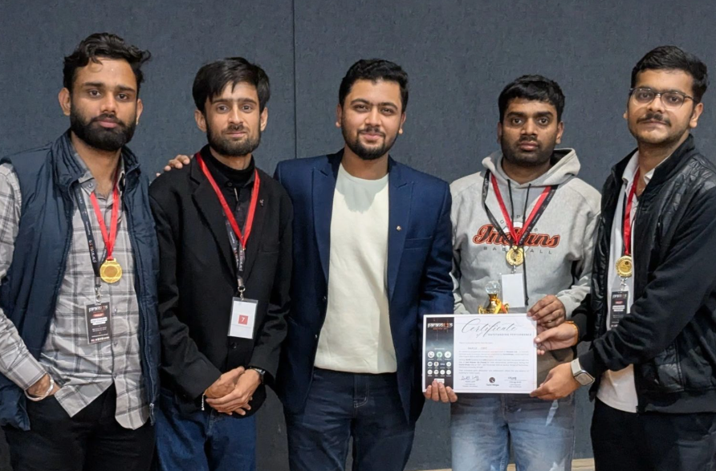
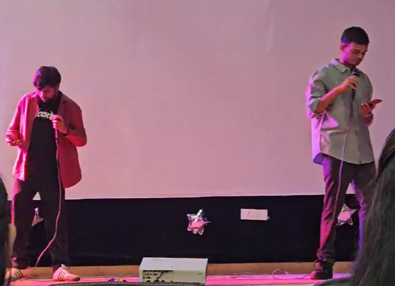
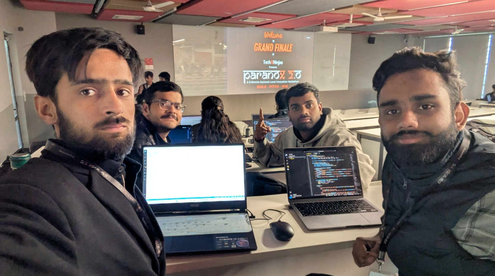
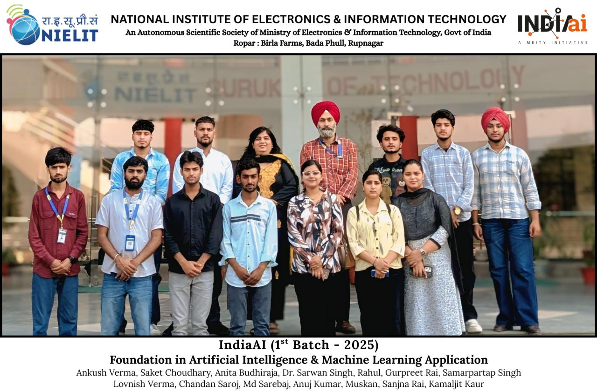

<!-- README.md -->

  <h1>🚀 Chandan Saroj: AI/ML Enthusiast | Full-Stack Architect</h1>
  <h2><i>MERN Stack | CNN | LLMs | Agentic AI</i></h2>

  
  

 

  
  
  

  

 

  <h3>✨ EXPLORE MY WORK ✨</h3>
  

 

> **Passionate MERN Stack Developer** with hands-on experience building scalable, real-world solutions at the intersection of full-stack development and cutting-edge **Artificial Intelligence**. Currently building high-performance systems at **Webcreaters**, and previously designed high-traffic exam and admission portals as an SDE at NIELIT Ropar. I integrate AI/ML capabilities, including real-time object detection (CNN), LLMs, and agentic workflows, to automate and enhance critical workflows from concept to production.

 

## 🌐 Quick Overview
- 🔭 **Current Role**: MERN Stack Developer at Webcreaters.
- 🌱 **Research & AI**: Published heavily on Generative AI, NLP, and ML in Springer journals.
- 📈 **Impact**: **Total 6 Citations** across my research on Google Scholar.
- 📫 **Contact**: Reach me at [chandansaroj2298@gmail.com](mailto:chandansaroj2298@gmail.com)
- 📄 **Resume**: [View my full experience](https://drive.google.com/file/d/1X4eA4hn_IIsQ2_S6SK27XYW5kH1jewCN/view)
- 🎬 **YouTube**: Creating music and tech content at [SarojXCI](https://www.youtube.com/@SarojXCI).

---

## 🛠️ Neural Networks, Data & Development Stack

### 🧠 AI & Machine Learning
**Core**: Neural Networks, CNNs, Agentic AI, LLMs, Generative AI, Computer Vision  
**Data Science**: Python, NumPy, Pandas, Scikit-learn, OpenCV  

### 💻 Full-Stack & Architecture
**Languages**: ASP.NET, SQL, C#, Visual Basic, Python, PHP, JavaScript, C/C++, TypeScript  
**Stack**: MERN (MongoDB, Express, React, Node.js), Django, MVC, SSRS, Prisma ORM  
**Databases**: Microsoft SQL Server, MySQL, MongoDB, Firebase  
**Tools**: GitHub, Git, Glitch, Froala Editor, Postman, PowerBI concepts  

  
  
  
  
  
  
  
  
  

---

## 🚀 Featured Projects

- **[SimpleBit Crypto Platform](https://simple-bit.com/)**  
  A cryptocurrency tracking and management platform architected on the **MERN stack**.
- **[NIELIT Secure Question Paper Platform](https://nielit.ac.in/)**  
  A **leak-proof, encrypted question paper generation system** using **SHA-256 hashing in SQL Server**, ensuring zero plaintext exposure to DBAs. Features SSRS PDF generation.
- **[Aksumbase Platform](https://aksumbase.com/)**  
  Scalable software solution integrating complex backend architecture.
- **[Smart Lane AI (Paranox 2.0 Winner)]**  
  An advanced emergency vehicle detection system built using **YOLOv8** and **TensorFlow**. Focuses on critical vehicle detection and efficient CNN implementations.
- **[Resume Summarization System (Generative AI)]**  
  Designed an **RNN model** mapped to an intuitive UI to assist recruiters in application tracking. Research paper accepted at Springer.
- **[The Hidout Booking Engine]**  
  Engineered core backend availability and complex notification logic for a property management system.
- **[DriveAI Navigation]**  
  An AI-navigated car dealership web interface highlighting automation and smart UX workflows.

---

## 📜 Research Work (6 Citations)

Explore my publications on [Google Scholar](https://scholar.google.com/citations?user=_7qIvaoAAAAJ&hl=en):
- **Generating Synthetic Different House Floor Layout Images Using Diffusion Model** (2025)
- **Audio Classification Using Deep Learning** (2025)
- **Resume Summarization - An Application of Generative AI** 
- **Assessing Online Products Using NLTK Based Machine Learning Model** 

---

## 🏆 Achievements & Participations
- **NICEDT 2025**: Best Research Paper Awardee and Best Project Award in Artificial Intelligence and Machine Learning.
- **NICEDT 2025**: Runner-Up for Research Presentation.
- **Paranox 2.0 National Hackathon**: 2nd Runner-Up.
- **Amazon ML Challenge 2023**: Participated and gained hands-on ML experience.

---

## 🎯 Dual Passions: Code & Creativity

- **Chess**: Active player on [Chess.com](https://www.chess.com/member/chaupat_raja).
- **Music Production**: Rap artist; check out my latest vocal tracks and studio sessions on [SarojXCI](https://www.youtube.com/@SarojXCI).
- **Traveling**: Passionate about exploring new places and cultures.

  

---

<!-- 🟢 CHANGED: Moved this entire section to the bottom, reduced the image sizes drastically, and aligned them in a single horizontal row using a 1x4 table grid -->
## 📸 Highlights & Journey

  <table>
    <tr>
      <td align="center"> In Press Release</td>
      <td align="center"> Winning Awards in AI Field</td>
      <td align="center"> Hackathon 2.0, 2nd Runner Up</td>
      <td align="center"> Music</td>
      <td align="center"> Coding Challenges</td>
      <td align="center"> Meity government project: IndiaAI</td>
    </tr>
  </table>

<!-- 🟢 END CHANGED -->
